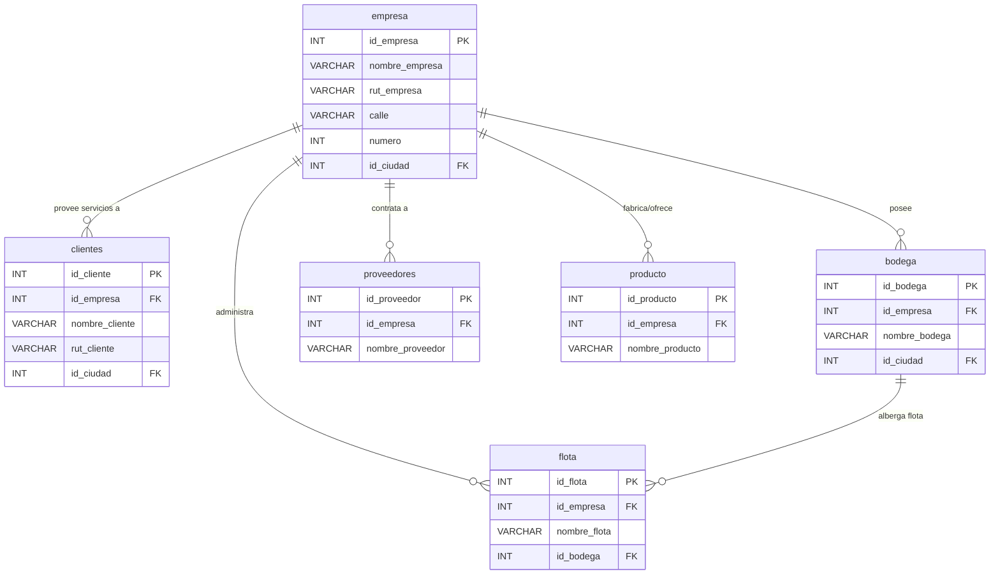

# 🏢 Módulo: Empresas y Recursos

Aquí vemos la columna vertebral del sistema:  
cómo una empresa se vincula con diferentes recursos y entidades operativas.

**Explicación:**
- Una **empresa** puede **poseer varias bodegas**, **administrar flotas**, **fabricar productos** y **proveer servicios a clientes**.
- Una **bodega** está asociada a una empresa y puede **albergar flotas**.