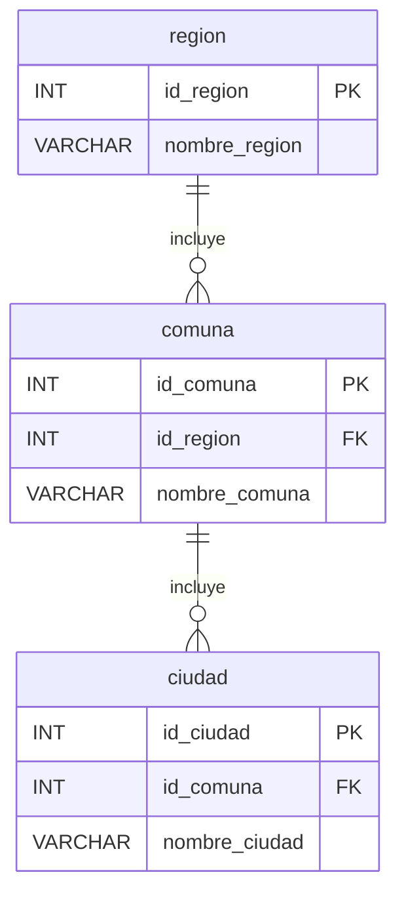

# 🌍 Módulo: Geografía

Este módulo representa la estructura jerárquica de ubicación utilizada en el sistema:  
**Región > Comuna > Ciudad**.  
Sirve como base para ubicar empresas, clientes y bodegas.

- **region incluye comunas:** Una región puede tener muchas comunas.
- **comuna incluye ciudades:** Una comuna puede tener muchas ciudades.