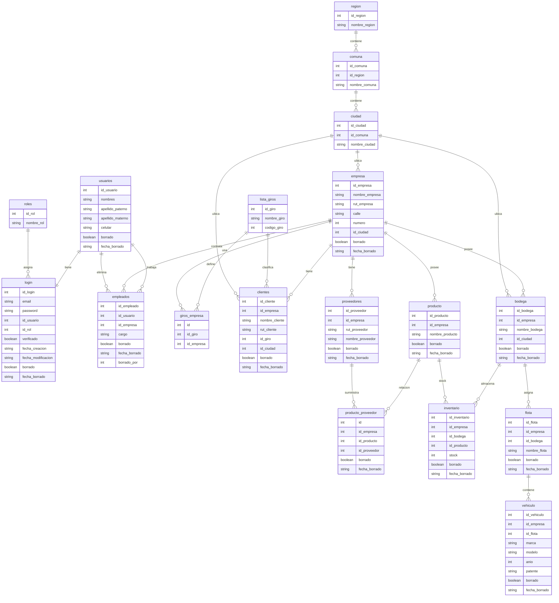

## 🗄️ Database Diagram

```mermaid
erDiagram

    region {
        int id_region
        string nombre_region
    }

    comuna {
        int id_comuna
        int id_region
        string nombre_comuna
    }

    ciudad {
        int id_ciudad
        int id_comuna
        string nombre_ciudad
    }

    empresa {
        int id_empresa
        string nombre_empresa
        string rut_empresa
        string calle
        int numero
        int id_ciudad
        boolean borrado
        string fecha_borrado
    }

    usuarios {
        int id_usuario
        string nombres
        string apellido_paterno
        string apellido_materno
        string celular
        boolean borrado
        string fecha_borrado
    }

    roles {
        int id_rol
        string nombre_rol
    }

    login {
        int id_login
        string email
        string password
        int id_usuario
        int id_rol
        boolean verificado
        string fecha_creacion
        string fecha_modificacion
        boolean borrado
        string fecha_borrado
    }

    empleados {
        int id_empleado
        int id_usuario
        int id_empresa
        string cargo
        boolean borrado
        string fecha_borrado
        int borrado_por
    }

    lista_giros {
        int id_giro
        string nombre_giro
        int codigo_giro
    }

    giros_empresa {
        int id
        int id_giro
        int id_empresa
    }

    clientes {
        int id_cliente
        int id_empresa
        string nombre_cliente
        string rut_cliente
        int id_giro
        int id_ciudad
        boolean borrado
        string fecha_borrado
    }

    bodega {
        int id_bodega
        int id_empresa
        string nombre_bodega
        int id_ciudad
        boolean borrado
        string fecha_borrado
    }

    proveedores {
        int id_proveedor
        int id_empresa
        string rut_proveedor
        string nombre_proveedor
        boolean borrado
        string fecha_borrado
    }

    producto {
        int id_producto
        int id_empresa
        string nombre_producto
        boolean borrado
        string fecha_borrado
    }

    producto_proveedor {
        int id
        int id_empresa
        int id_producto
        int id_proveedor
        boolean borrado
        string fecha_borrado
    }

    inventario {
        int id_inventario
        int id_empresa
        int id_bodega
        int id_producto
        int stock
        boolean borrado
        string fecha_borrado
    }

    flota {
        int id_flota
        int id_empresa
        int id_bodega
        string nombre_flota
        boolean borrado
        string fecha_borrado
    }

    vehiculo {
        int id_vehiculo
        int id_empresa
        int id_flota
        string marca
        string modelo
        int anio
        string patente
        boolean borrado
        string fecha_borrado
    }

    region ||--o{ comuna : contiene
    comuna ||--o{ ciudad : contiene
    ciudad ||--o{ empresa : ubica

    usuarios ||--|| login : tiene
    roles ||--o{ login : asigna
    usuarios ||--o{ empleados : trabaja
    empresa ||--o{ empleados : contrata
    usuarios ||--o{ empleados : elimina

    lista_giros ||--o{ giros_empresa : define
    empresa ||--o{ giros_empresa : usa

    empresa ||--o{ clientes : tiene
    lista_giros ||--o{ clientes : clasifica
    ciudad ||--o{ clientes : ubica

    empresa ||--o{ bodega : posee
    ciudad ||--o{ bodega : ubica

    empresa ||--o{ proveedores : tiene
    empresa ||--o{ producto : posee

    producto ||--o{ producto_proveedor : relacion
    proveedores ||--o{ producto_proveedor : suministra

    bodega ||--o{ inventario : almacena
    producto ||--o{ inventario : stock

    bodega ||--o{ flota : asigna
    flota ||--o{ vehiculo : contiene
```
