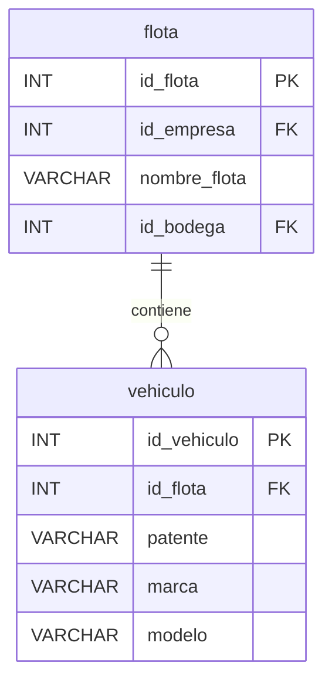

# 🚚 Módulo: Flota y Vehículos

Visualiza la estructura de la administración de flotas y los vehículos asignados.

- Una **flota** representa un grupo de vehículos y está vinculada a una empresa y a una bodega.
- Un **vehículo** pertenece a una flota dada.

[⬅️ Operaciones y Stock](./ERD_operaciones_stock.md)   [⬆️ Índice](./../../Base de datos/README.md)   [➡️ Giros y Relaciones](./ERD_giros.md)