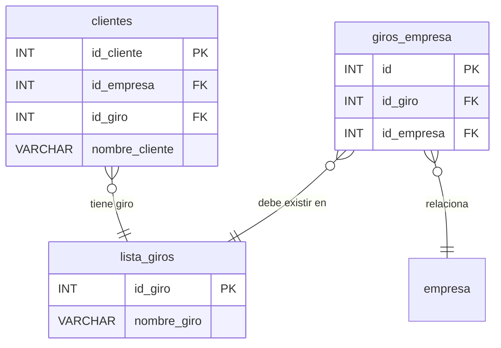

# 🔄 Módulo: Giros y Relaciones

Explica cómo las empresas y clientes se asocian a diferentes rubros económicos (giros).

- Un **giro** representa una actividad económica.
- Una **empresa** puede tener varios giros y un **cliente** está asociado a uno.

[⬅️ Flota y Vehículos](./ERD_flota_vehiculo.md)   [⬆️ Índice](./../../Base%20de%20datos/README.md)