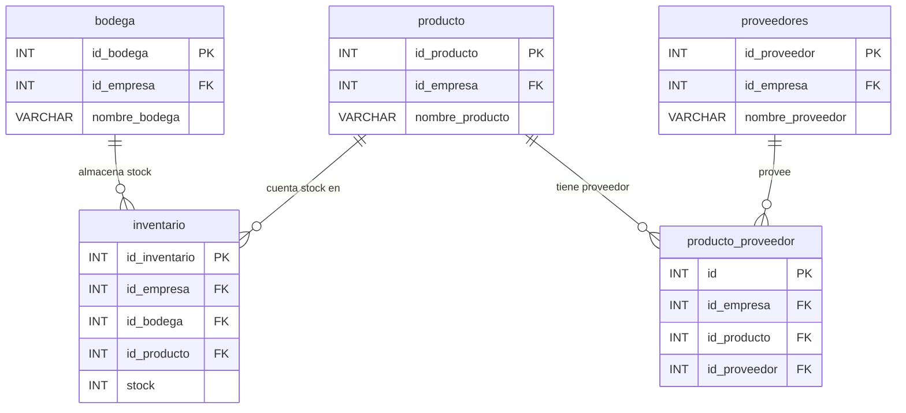

# 📦 Módulo: Operaciones y Stock

Describe el flujo de productos y gestión de inventario.

- Un **producto** puede tener varios **proveedores** y almacenarse en diferentes **bodegas**.
- El **inventario** vincula productos y bodegas para saber dónde y cuánto hay.

[⬅️ Usuarios, Login y Roles](./ERD_usuarios_roles.md)   [⬆️ Índice](../../Base de datos/README.md)   [➡️ Flota y Vehículos](./ERD_flota_vehiculo.md)