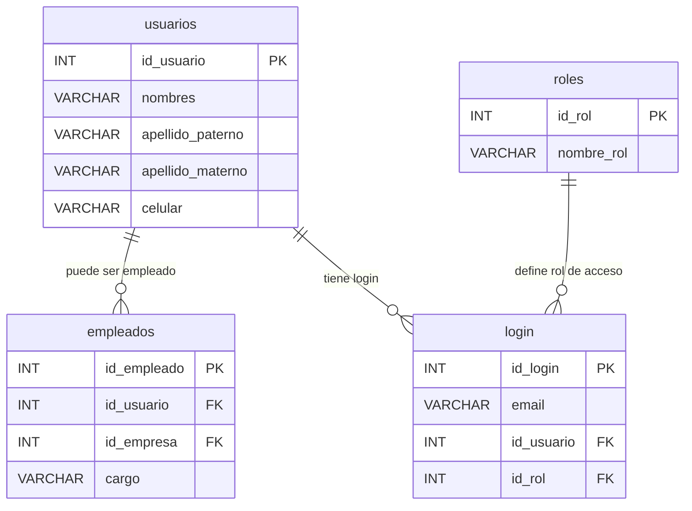

# 👥 Módulo: Usuarios, Login y Roles

Describe cómo se gestiona la autenticación y las relaciones laborales en el sistema.

- Un **usuario** puede ser **empleado de una empresa** y/o **tener acceso de login**.
- La tabla **login** define credenciales y se relaciona también con los **roles de acceso**.

[⬅️ Empresas y Recursos](./ERD_empresas_recursos.md)   [⬆️ Índice](./../../Base%20de%20datos/README.md)   [➡️ Operaciones y Stock](./ERD_operaciones_stock.md)